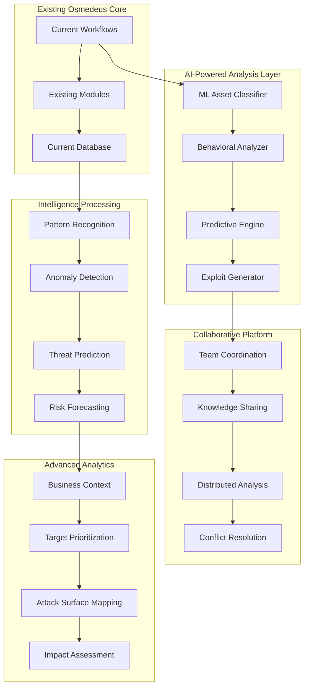
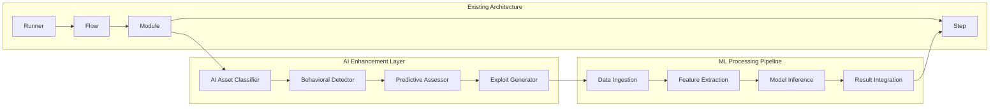

# Design Document

## Overview

The deep scanning upgrade transforms Osmedeus into an AI-powered reconnaissance platform that adds sophisticated intelligence capabilities on top of the existing workflow engine. The design introduces advanced analysis modules that leverage machine learning, behavioral analysis, and predictive assessment while maintaining full compatibility with current scanning workflows.

The upgrade focuses on five revolutionary areas:
1. **AI-Powered Analysis Engine** - Machine learning for asset classification, vulnerability prediction, and pattern recognition
2. **Behavioral Detection Framework** - Anomaly detection, hidden service discovery, and suspicious activity identification
3. **Predictive Security Assessment** - ML-based vulnerability forecasting and risk prediction
4. **Automated Exploit Generation** - Dynamic exploit creation, validation, and impact assessment
5. **Collaborative Intelligence Platform** - Team coordination, knowledge sharing, and distributed analysis

## Architecture

### High-Level Architecture



### AI-Enhanced Module Architecture

The system extends the existing Osmedeus architecture with AI-powered modules that plug into the current workflow system:



## Components and Interfaces

### 1. AI-Powered Asset Classification Engine

**Purpose**: Use machine learning to automatically classify discovered assets and assign business criticality scores.

**Key Components**:

- **MLAssetClassifier**: Neural network-based asset type classification
- **BusinessContextAnalyzer**: OSINT-based business value assessment
- **AssetClusteringEngine**: Groups similar assets using unsupervised learning
- **CriticalityScorer**: Assigns business impact scores based on multiple factors

**Interfaces**:

```go
type AIAssetClassifier interface {
    ClassifyAsset(asset Asset) (*AssetClassification, error)
    TrainModel(trainingData []LabeledAsset) error
    UpdateModel(newData []LabeledAsset) error
    GetConfidenceScore(asset Asset) float64
}

type AssetClassification struct {
    Type             string    `json:"type"`              // production, staging, dev, admin, api
    Confidence       float64   `json:"confidence"`
    BusinessValue    float64   `json:"business_value"`
    CriticalityLevel string    `json:"criticality_level"` // critical, high, medium, low
    Reasoning        []string  `json:"reasoning"`
    SimilarAssets    []string  `json:"similar_assets"`
}

type BusinessContextAnalyzer interface {
    AnalyzeBusinessContext(domain string) (*BusinessContext, error)
    GetCompanyProfile(domain string) (*CompanyProfile, error)
    AssessBusinessValue(context *BusinessContext) float64
}
```

### 2. Behavioral Analysis and Anomaly Detection Framework

**Purpose**: Detect unusual patterns, hidden services, and suspicious activities that traditional scans miss.

**Key Components**:

- **BehavioralAnalyzer**: Analyzes service response patterns and timing
- **AnomalyDetector**: Machine learning-based anomaly detection
- **HiddenServiceDiscoverer**: Finds concealed endpoints and services
- **SuspiciousActivityTracker**: Identifies potential backdoors and covert channels

**Interfaces**:

```go
type BehavioralAnalyzer interface {
    AnalyzeBehavior(target string, responses []Response) (*BehaviorProfile, error)
    DetectAnomalies(profile *BehaviorProfile) ([]Anomaly, error)
    TrainBaselineModel(normalTraffic []TrafficSample) error
    UpdateBehaviorModel(newSamples []TrafficSample) error
}

type BehaviorProfile struct {
    ResponsePatterns    []ResponsePattern `json:"response_patterns"`
    TimingCharacteristics TimingProfile   `json:"timing_characteristics"`
    ErrorPatterns       []ErrorPattern    `json:"error_patterns"`
    AnomalyScore        float64          `json:"anomaly_score"`
    SuspiciousIndicators []string        `json:"suspicious_indicators"`
}

type AnomalyDetector interface {
    DetectNetworkAnomalies(traffic []NetworkPacket) ([]NetworkAnomaly, error)
    DetectServiceAnomalies(services []Service) ([]ServiceAnomaly, error)
    DetectProtocolAnomalies(protocols []ProtocolData) ([]ProtocolAnomaly, error)
    UpdateAnomalyModel(feedback []AnomalyFeedback) error
}
```

### 3. Predictive Security Assessment Engine

**Purpose**: Use machine learning to predict future vulnerabilities and security risks before they are exploited.

**Key Components**:

- **VulnerabilityPredictor**: ML model for predicting vulnerability emergence
- **RiskForecaster**: Forecasts attack surface evolution and risk trends
- **ThreatEvolutionAnalyzer**: Predicts how threats will evolve over time
- **ProactiveAlertSystem**: Generates early warnings for potential security issues

**Interfaces**:

```go
type PredictiveEngine interface {
    PredictVulnerabilities(asset Asset, timeframe time.Duration) (*VulnerabilityPrediction, error)
    ForecastRiskTrends(targets []string, timeframe time.Duration) (*RiskForecast, error)
    AnalyzeThreatEvolution(historicalData []ThreatData) (*ThreatEvolution, error)
    GenerateProactiveAlerts(predictions []Prediction) ([]ProactiveAlert, error)
}

type VulnerabilityPrediction struct {
    PredictedVulns      []PredictedVulnerability `json:"predicted_vulnerabilities"`
    ConfidenceLevel     float64                  `json:"confidence_level"`
    TimeToEmergence     time.Duration            `json:"time_to_emergence"`
    PreventiveMeasures  []string                 `json:"preventive_measures"`
    RiskFactors         []RiskFactor             `json:"risk_factors"`
}

type RiskForecaster interface {
    ForecastAttackSurface(current AttackSurface, timeframe time.Duration) (*AttackSurfaceForecast, error)
    PredictSecurityPosture(metrics []SecurityMetric, timeframe time.Duration) (*SecurityPostureForecast, error)
    RecommendProactiveMeasures(forecast *RiskForecast) ([]ProactiveMeasure, error)
}
```

### 4. Automated Exploit Generation and Validation System

**Purpose**: Automatically generate, validate, and assess proof-of-concept exploits for discovered vulnerabilities.

**Key Components**:

- **ExploitGenerator**: Creates PoC exploits based on vulnerability data
- **ExploitValidator**: Tests exploits in sandboxed environments
- **ImpactAssessor**: Evaluates real-world impact and exploitability
- **ExploitChainBuilder**: Constructs multi-stage attack sequences

**Interfaces**:

```go
type ExploitGenerator interface {
    GenerateExploit(vuln Vulnerability) (*GeneratedExploit, error)
    ValidateExploit(exploit *GeneratedExploit, target Target) (*ExploitValidation, error)
    BuildExploitChain(vulns []Vulnerability) (*ExploitChain, error)
    AssessExploitability(exploit *GeneratedExploit) (*ExploitabilityAssessment, error)
}

type GeneratedExploit struct {
    ID                  string            `json:"id"`
    VulnerabilityID     string            `json:"vulnerability_id"`
    ExploitCode         string            `json:"exploit_code"`
    ExploitType         string            `json:"exploit_type"`
    Prerequisites       []string          `json:"prerequisites"`
    ExpectedImpact      string            `json:"expected_impact"`
    ValidationStatus    string            `json:"validation_status"`
    SuccessProbability  float64           `json:"success_probability"`
    GenerationMethod    string            `json:"generation_method"`
    Metadata            map[string]string `json:"metadata"`
}

type ExploitValidator interface {
    CreateSandbox(target Target) (*Sandbox, error)
    ExecuteExploit(exploit *GeneratedExploit, sandbox *Sandbox) (*ExecutionResult, error)
    AnalyzeExploitSuccess(result *ExecutionResult) (*SuccessAnalysis, error)
    CleanupSandbox(sandbox *Sandbox) error
}
```

### 5. Collaborative Intelligence and Team Coordination Platform

**Purpose**: Enable team collaboration, knowledge sharing, and coordinated analysis across multiple security professionals.

**Key Components**:

- **TeamCoordinator**: Manages team assignments and task distribution
- **KnowledgeShareEngine**: Facilitates sharing of findings and insights
- **CollaborativeAnalyzer**: Enables real-time collaborative analysis
- **ConflictResolver**: Handles overlapping work and conflicting findings

**Interfaces**:

```go
type CollaborativePlatform interface {
    CreateTeamWorkspace(team Team) (*Workspace, error)
    AssignTasks(tasks []Task, members []TeamMember) error
    ShareFindings(findings []Finding, workspace *Workspace) error
    ResolveConflicts(conflicts []Conflict) (*Resolution, error)
}

type TeamCoordinator interface {
    DistributeWork(targets []string, team Team) (*WorkDistribution, error)
    TrackProgress(workspace *Workspace) (*ProgressReport, error)
    PreventDuplication(newTask Task, existingTasks []Task) (*DuplicationCheck, error)
    CoordinateScanning(scanRequests []ScanRequest) (*ScanCoordination, error)
}

type KnowledgeShareEngine interface {
    CreateKnowledgeBase(workspace *Workspace) (*KnowledgeBase, error)
    AddFinding(finding Finding, kb *KnowledgeBase) error
    SearchKnowledge(query string, kb *KnowledgeBase) ([]KnowledgeItem, error)
    GenerateInsights(findings []Finding) ([]Insight, error)
}

type CollaborativeAnalysis struct {
    SessionID           string              `json:"session_id"`
    Participants        []TeamMember        `json:"participants"`
    SharedFindings      []Finding           `json:"shared_findings"`
    CollaborativeNotes  []Note              `json:"collaborative_notes"`
    RealTimeUpdates     []Update            `json:"realtime_updates"`
    ConflictResolutions []ConflictResolution `json:"conflict_resolutions"`
}
```

## Data Models

### AI-Enhanced Data Models

```go
// Enhanced Target with AI-powered analysis results
type AIEnhancedTarget struct {
    database.Target
    
    // AI Classification Results
    AssetClassification  *AssetClassification     `json:"asset_classification"`
    BusinessContext      *BusinessContext         `json:"business_context"`
    BehaviorProfile      *BehaviorProfile         `json:"behavior_profile"`
    AnomalyScore         float64                  `json:"anomaly_score"`
    
    // Predictive Analysis
    VulnPredictions      []VulnerabilityPrediction `json:"vulnerability_predictions"`
    RiskForecast         *RiskForecast            `json:"risk_forecast"`
    ThreatEvolution      *ThreatEvolution         `json:"threat_evolution"`
    
    // Exploit Analysis
    GeneratedExploits    []GeneratedExploit       `json:"generated_exploits"`
    ExploitChains        []ExploitChain           `json:"exploit_chains"`
    ExploitValidations   []ExploitValidation      `json:"exploit_validations"`
    
    // Collaborative Data
    TeamAssignments      []TeamAssignment         `json:"team_assignments"`
    SharedFindings       []SharedFinding          `json:"shared_findings"`
    CollaborativeNotes   []CollaborativeNote      `json:"collaborative_notes"`
}

// Business Context from OSINT analysis
type BusinessContext struct {
    CompanyName          string                   `json:"company_name"`
    Industry             string                   `json:"industry"`
    CompanySize          string                   `json:"company_size"`
    Revenue              string                   `json:"revenue"`
    BusinessValue        float64                  `json:"business_value"`
    CriticalityFactors   []string                 `json:"criticality_factors"`
    PublicProfile        map[string]interface{}   `json:"public_profile"`
    RiskFactors          []string                 `json:"risk_factors"`
}

// Behavioral analysis results
type BehaviorProfile struct {
    ResponsePatterns     []ResponsePattern        `json:"response_patterns"`
    TimingProfile        TimingCharacteristics    `json:"timing_profile"`
    ErrorPatterns        []ErrorPattern           `json:"error_patterns"`
    AnomalyIndicators    []AnomalyIndicator       `json:"anomaly_indicators"`
    SuspiciousActivities []SuspiciousActivity     `json:"suspicious_activities"`
    BaselineDeviation    float64                  `json:"baseline_deviation"`
    ConfidenceScore      float64                  `json:"confidence_score"`
}

// Predictive vulnerability analysis
type VulnerabilityPrediction struct {
    PredictionID         string                   `json:"prediction_id"`
    TargetAsset          string                   `json:"target_asset"`
    PredictedVulnType    string                   `json:"predicted_vuln_type"`
    EmergenceProbability float64                  `json:"emergence_probability"`
    TimeToEmergence      time.Duration            `json:"time_to_emergence"`
    RiskFactors          []RiskFactor             `json:"risk_factors"`
    PreventiveMeasures   []PreventiveMeasure      `json:"preventive_measures"`
    ModelConfidence      float64                  `json:"model_confidence"`
    PredictionBasis      []string                 `json:"prediction_basis"`
}

// Exploit chain analysis
type ExploitChain struct {
    ChainID              string                   `json:"chain_id"`
    Name                 string                   `json:"name"`
    Description          string                   `json:"description"`
    AttackSteps          []AttackStep             `json:"attack_steps"`
    Prerequisites        []string                 `json:"prerequisites"`
    SuccessProbability   float64                  `json:"success_probability"`
    ImpactAssessment     ImpactAssessment         `json:"impact_assessment"`
    Mitigations          []Mitigation             `json:"mitigations"`
    ValidationResults    []ValidationResult       `json:"validation_results"`
}

// Team collaboration models
type TeamAssignment struct {
    AssignmentID         string                   `json:"assignment_id"`
    TeamMember           TeamMember               `json:"team_member"`
    AssignedTargets      []string                 `json:"assigned_targets"`
    TaskType             string                   `json:"task_type"`
    Priority             string                   `json:"priority"`
    Status               string                   `json:"status"`
    Progress             float64                  `json:"progress"`
    Deadline             time.Time                `json:"deadline"`
    Dependencies         []string                 `json:"dependencies"`
}

type SharedFinding struct {
    FindingID            string                   `json:"finding_id"`
    DiscoveredBy         TeamMember               `json:"discovered_by"`
    FindingType          string                   `json:"finding_type"`
    Severity             string                   `json:"severity"`
    Description          string                   `json:"description"`
    Evidence             []Evidence               `json:"evidence"`
    Validation           ValidationStatus         `json:"validation"`
    SharedWith           []TeamMember             `json:"shared_with"`
    Annotations          []Annotation             `json:"annotations"`
    Timestamp            time.Time                `json:"timestamp"`
}

// Anomaly detection models
type AnomalyIndicator struct {
    IndicatorType        string                   `json:"indicator_type"`
    Description          string                   `json:"description"`
    Severity             string                   `json:"severity"`
    AnomalyScore         float64                  `json:"anomaly_score"`
    DetectionMethod      string                   `json:"detection_method"`
    Evidence             []string                 `json:"evidence"`
    FalsePositiveProb    float64                  `json:"false_positive_probability"`
    RecommendedAction    string                   `json:"recommended_action"`
}

type SuspiciousActivity struct {
    ActivityID           string                   `json:"activity_id"`
    ActivityType         string                   `json:"activity_type"`
    Description          string                   `json:"description"`
    SuspicionLevel       string                   `json:"suspicion_level"`
    Indicators           []string                 `json:"indicators"`
    PotentialThreats     []string                 `json:"potential_threats"`
    RecommendedResponse  []string                 `json:"recommended_response"`
    FirstObserved        time.Time                `json:"first_observed"`
    LastObserved         time.Time                `json:"last_observed"`
}
```

## Error Handling

### Comprehensive Error Management

The system implements a multi-layered error handling approach:

1. **Graceful Degradation**: If one discovery technique fails, others continue
2. **Retry Mechanisms**: Automatic retry with exponential backoff for transient failures
3. **Error Categorization**: Classify errors by type (network, parsing, authentication, etc.)
4. **Fallback Strategies**: Alternative approaches when primary methods fail
5. **Error Reporting**: Detailed error logs with context and remediation suggestions

```go
type ScanError struct {
    Type        ErrorType `json:"type"`
    Component   string    `json:"component"`
    Message     string    `json:"message"`
    Timestamp   time.Time `json:"timestamp"`
    Severity    string    `json:"severity"`
    Retryable   bool      `json:"retryable"`
    Context     map[string]interface{} `json:"context"`
}

type ErrorHandler interface {
    HandleError(err error, context ScanContext) error
    ShouldRetry(err error) bool
    GetFallbackStrategy(err error) FallbackStrategy
}
```

## Testing Strategy

### Multi-Level Testing Approach

1. **Unit Tests**: Test individual components and functions
   - Discovery technique implementations
   - Vulnerability detection engines
   - Data correlation algorithms
   - Report generation functions

2. **Integration Tests**: Test component interactions
   - Discovery engine with multiple techniques
   - Analysis framework with vulnerability engines
   - Database operations with data correlation
   - API endpoints with authentication

3. **End-to-End Tests**: Test complete workflows
   - Full scan execution from input to report
   - Multi-target scanning scenarios
   - Historical analysis and change detection
   - Report generation and export

4. **Performance Tests**: Validate scalability and efficiency
   - Large-scale subdomain enumeration
   - Concurrent vulnerability scanning
   - Database query performance
   - Memory usage optimization

5. **Security Tests**: Ensure the scanner itself is secure
   - Input validation and sanitization
   - Authentication and authorization
   - Data encryption and protection
   - API security testing

### Test Data and Environments

- **Controlled Test Environment**: Isolated network with known vulnerabilities
- **Synthetic Test Data**: Generated datasets for performance testing
- **Real-World Validation**: Controlled tests against known targets
- **Regression Testing**: Automated tests for backward compatibility

## Performance Considerations

### Optimization Strategies

1. **Concurrent Processing**: Parallel execution of discovery and analysis tasks
2. **Intelligent Caching**: Cache DNS lookups, service fingerprints, and vulnerability data
3. **Database Optimization**: Proper indexing, query optimization, and connection pooling
4. **Memory Management**: Efficient data structures and garbage collection tuning
5. **Network Optimization**: Connection reuse, rate limiting, and timeout management

### Scalability Features

- **Horizontal Scaling**: Support for distributed scanning across multiple nodes
- **Load Balancing**: Distribute scan tasks based on resource availability
- **Resource Management**: Dynamic allocation based on scan complexity
- **Queue Management**: Prioritize scans based on criticality and resource requirements

## Security Considerations

### Security-First Design

1. **Input Validation**: Comprehensive validation of all user inputs and scan targets
2. **Authentication**: Strong authentication mechanisms for API access
3. **Authorization**: Role-based access control for different user types
4. **Data Protection**: Encryption of sensitive data at rest and in transit
5. **Audit Logging**: Comprehensive logging of all system activities
6. **Network Security**: Secure communication protocols and network isolation
7. **Vulnerability Management**: Regular updates and security patches

### Privacy and Compliance

- **Data Retention**: Configurable data retention policies
- **Data Anonymization**: Options to anonymize sensitive information
- **Compliance Reporting**: Support for various compliance frameworks
- **Export Controls**: Restrictions on sensitive vulnerability data